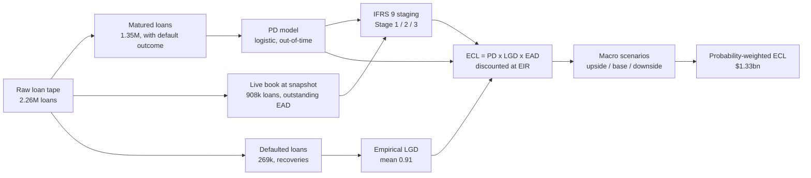
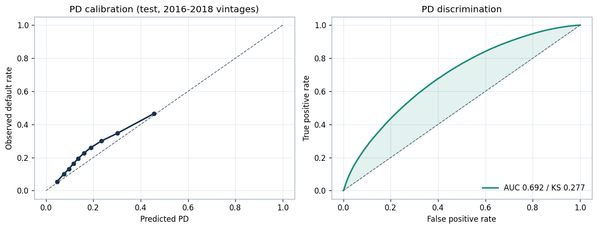
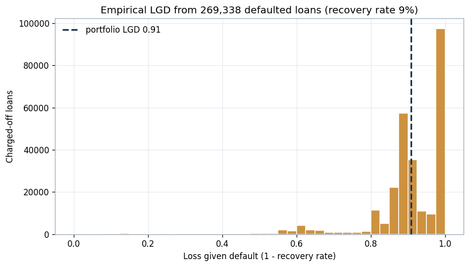
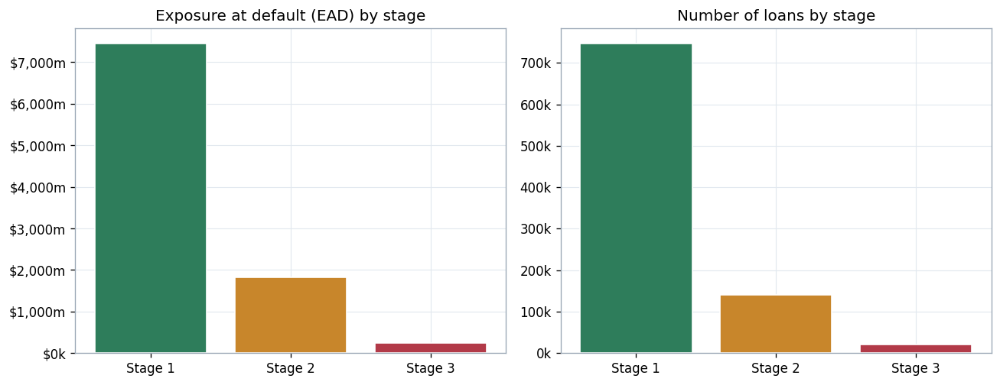
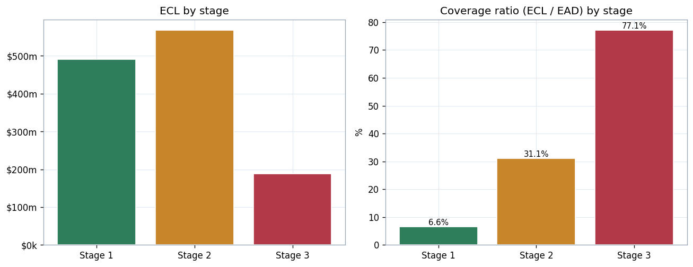
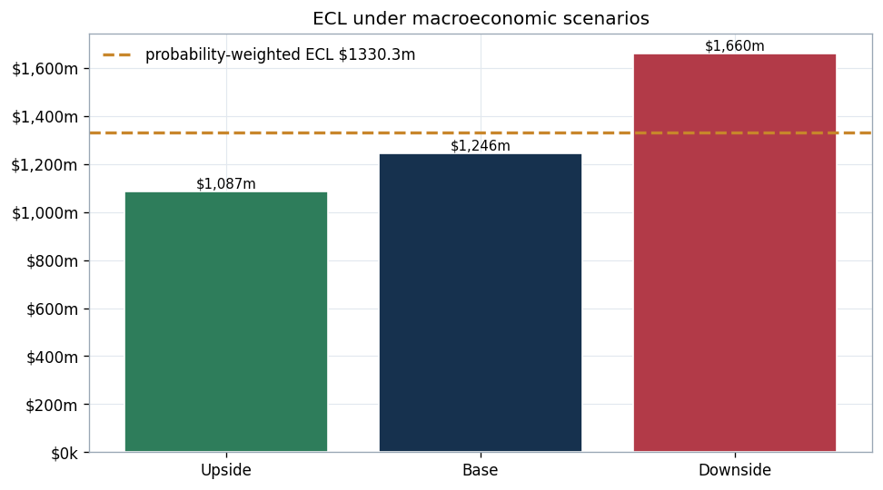
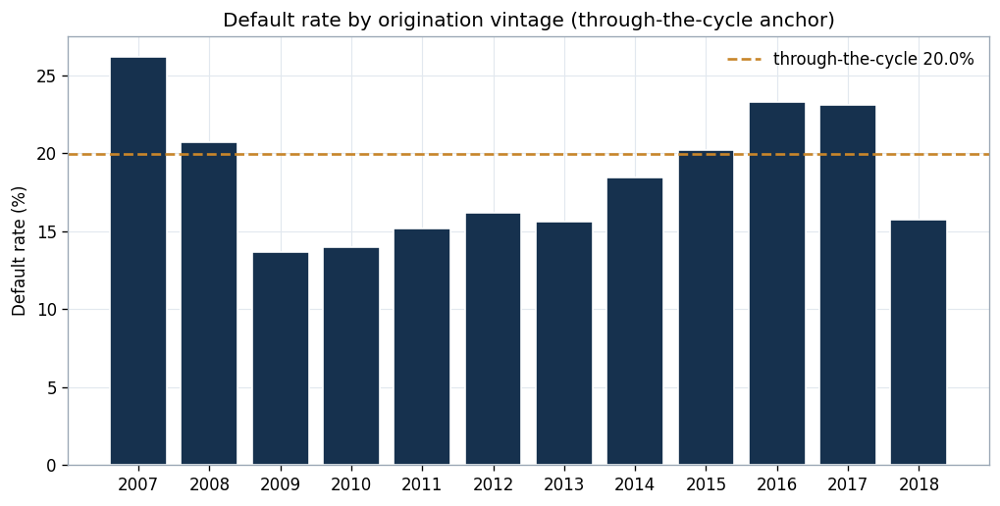
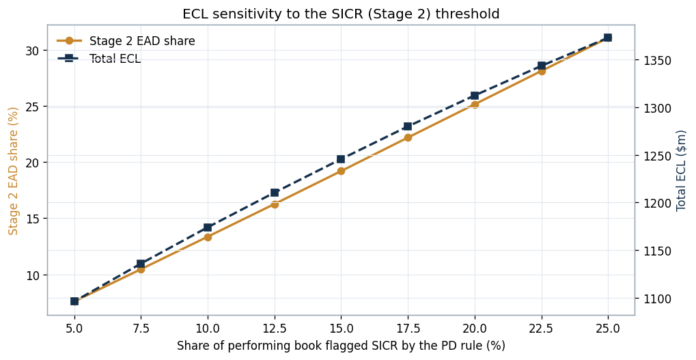

# IFRS 9 Expected Credit Loss (ECL) Engine

**An end-to-end IFRS 9 impairment model on 1.35 million real loans: PD, LGD, EAD, three-stage staging, and probability-weighted macroeconomic scenarios.**

This project builds the calculation that sits at the centre of credit risk in a regulated lender: the expected credit loss a bank must hold against its loan book under IFRS 9. It estimates each parameter (probability of default, loss given default, exposure at default) from real data, allocates a live loan book across the three IFRS 9 stages, computes the ECL, and runs it through upside, base and downside macroeconomic scenarios. Every number below comes from the data, not an illustration.

---

## Why this matters

Under IFRS 9, a lender cannot simply book a loan at face value. It must recognise an expected credit loss from day one, and that allowance is built from three parameters and a staging rule:

- **PD**, probability of default
- **LGD**, loss given default
- **EAD**, exposure at default
- **Staging**, Stage 1 (performing, 12-month ECL), Stage 2 (significant increase in credit risk, lifetime ECL), Stage 3 (credit-impaired, lifetime ECL)

`ECL = PD x LGD x EAD`, discounted, summed across the book, and weighted across macroeconomic scenarios. Getting it right drives the bank's impairment charge, its capital, and what it reports to its regulator. This project implements the whole chain.

---

## Headline results

A live loan book of **907,864 loans** and **$9.51bn** of exposure, staged and provisioned as at the data snapshot:

| Stage | Meaning | Loans | EAD | ECL | Coverage |
|------:|---------|------:|----:|----:|---------:|
| 1 | Performing (12-month ECL) | 746,242 | $7,441m | $490m | 6.6% |
| 2 | Significant increase in credit risk (lifetime ECL) | 140,181 | $1,825m | $567m | 31.1% |
| 3 | Credit-impaired (lifetime ECL) | 21,441 | $244m | $188m | 77.1% |
| **Total** | | **907,864** | **$9,510m** | **$1,246m** | **13.1%** |

The coverage ratio rises sharply across the stages (6.6% to 31.1% to 77.1%), which is exactly the IFRS 9 pattern: a performing loan carries a small 12-month allowance, a deteriorated loan a full lifetime allowance, and an impaired loan close to its loss given default.

**Parameters:** PD model AUC **0.692** (Gini 0.384, KS 0.277) on out-of-time validation; empirical LGD **0.91** from 269,338 defaulted loans (a 9% recovery rate, typical of unsecured lending); through-the-cycle default rate **20.0%**.

**Macroeconomic scenarios:** ECL ranges from **$1,087m** (upside) to **$1,246m** (base) to **$1,660m** (downside), giving a probability-weighted allowance of **$1,330m**.

---

## Method



**Data.** The Lending Club accepted-loans tape (2.26M loans). It splits naturally into three populations: matured loans with a known good or bad outcome (to fit the PD model), defaulted loans with recovery cash flows (to measure LGD), and loans still live at the snapshot with an outstanding balance (the book to provision). The 2018Q4 file date acts as the reporting date for staging.

**PD (12-month and lifetime).** A logistic model on borrower and loan attributes (FICO, debt-to-income, income, payment-to-income, loan-to-income, term, employment, revolving utilisation, delinquencies, inquiries, accounts, credit history, plus home ownership, purpose and verification). It is trained on 2007 to 2015 vintages and validated out-of-time on 2016 to 2018, so the test is on loans the model never saw. Lending Club's own grade and interest rate are excluded so the model earns its signal rather than copying the platform's pricing. The model output is a lifetime PD over the loan's life; a 12-month PD is derived from it with a constant-hazard adjustment over the remaining term.

**LGD (empirical).** For each charged-off loan, exposure at default is the principal still outstanding when it defaulted, and the recovery is the post-default cash collected net of fees. `LGD = 1 - recovery / exposure at default`, averaged across 269k defaults. The result, 0.91, reflects that recoveries on unsecured consumer loans are small.

**EAD.** The outstanding principal balance of each live loan at the snapshot.

**IFRS 9 staging.** Stage 3 is the credit-impaired bucket (loans 31+ days past due or in default). Stage 2 captures a significant increase in credit risk: loans in a grace period or early arrears, plus a simplified PD-based trigger that flags performing loans whose lifetime PD sits in the worst 15%. Stage 1 is everything else.

**ECL and discounting.** Stage 1 uses the 12-month PD, Stages 2 and 3 use lifetime PD (Stage 3 with PD set to one, since default has occurred). Each is multiplied by LGD and EAD and discounted at the loan's effective interest rate.

**Macroeconomic scenarios.** PD is point-in-time, so it is scaled by a macro overlay: upside, base and downside multipliers, probability-weighted into a single allowance. In a production setting these multipliers come from a macroeconomic PD model linking unemployment and GDP to default; here they are an explicit, documented stress, because conditioning on matured loans removes most vintage variation from this particular sample.

---

## Figures, with interpretation

**PD validation.** 
The model is reasonably calibrated against observed default on the out-of-time test (left), and separates good from bad with an AUC of 0.692 and a KS of 0.277 (right). Calibration matters more than discrimination for ECL, because the PD feeds a money figure, not just a ranking.

**Loss given default.** 
Empirical LGD clusters near one: recoveries on these unsecured loans average only 9% of the exposure outstanding at default. A secured book, such as vehicle finance, would show a much lower and more dispersed LGD because the collateral can be repossessed and sold.

**Staging the book.** 
Most exposure sits in Stage 1, with a meaningful Stage 2 tail and a small Stage 3 bucket. This is the allocation that decides whether a loan carries a 12-month or a lifetime allowance.

**ECL and coverage by stage.** 
The coverage ratio (allowance as a percentage of exposure) climbs from 6.6% in Stage 1 to 31.1% in Stage 2 to 77.1% in Stage 3. That escalation is the economic heart of IFRS 9.

**Macroeconomic scenarios.** 
The allowance is materially scenario-dependent, from $1.09bn in the upside to $1.66bn in the downside, with a probability-weighted result of $1.33bn. The weighting, not just the base case, is what gets reported.

**Through-the-cycle anchor.** 
Default rate by origination vintage among matured loans, with the through-the-cycle average marked. This anchors the base PD.

**SICR sensitivity.** 
How the allowance moves as the Stage 2 trigger is tightened or loosened. Flagging more of the performing book as significant-increase pushes loans onto a lifetime allowance and lifts total ECL from about $1.10bn to $1.37bn. This is a judgment lever, and one a second-line function would scrutinise closely.

---

## How a second line would challenge this

The point of the model is not only to produce a number but to be defensible. The obvious challenge points, and where the build already responds:

- **Is the PD calibrated, not just discriminating?** The calibration curve is shown, and out-of-time, because a miscalibrated PD biases the allowance directly.
- **Is the SICR trigger reasonable?** Its effect is quantified end to end (the sensitivity chart), rather than buried as a fixed assumption.
- **Is LGD measured or assumed?** It is measured from real recovery cash flows, with the population size stated.
- **Are the macro multipliers defensible?** They are explicit and documented as an overlay, with the production source named, rather than presented as if read from the data.

---

## Limitations

- **The data is US unsecured consumer lending.** The methodology transfers directly to an auto or captive-finance book, but the parameters would differ: a secured vehicle book would show a much lower LGD because of collateral recovery, and EAD would reflect the amortisation and any balloon or residual structure.
- **The macro overlay is illustrative.** A production model would link PD to macroeconomic drivers explicitly; here the multipliers are a documented stress.
- **The reporting date is the file snapshot.** Staging uses the loan status as at 2018Q4; a live system would re-stage every reporting period on fresh arrears data.
- **The SICR rule is simplified.** A full implementation compares current PD to origination PD per loan, alongside the arrears backstop.
- **PD is a single logistic model.** A companion project builds a Weight-of-Evidence scorecard and an independent validation, including benchmarking against a challenger.

The structural results, the rising coverage across stages, the high unsecured LGD, and the scenario sensitivity, are robust. Treat the exact dollar allowance as a first-order figure on illustrative data.

---

## Relevance

This implements the parameters and the calculation a credit-risk function reviews and validates day to day: ECL, PD, LGD, EAD, IFRS 9 staging, and macroeconomic scenarios. It is built to be challenged, with calibration, sensitivity and provenance made explicit, which is the posture a second-line oversight function takes toward first-line models.

---

## Run it

```bash
pip install -r requirements.txt
python analysis.py        # reproduces all figures and results.json
```

## Repository structure

```
.
├── analysis.py                 # full PD / LGD / EAD / staging / ECL / scenario pipeline
├── results.json                # all computed figures
├── figures/                    # seven generated charts
├── data/
│   └── scored_portfolio_sample.csv   # sample of the staged, scored live book
├── requirements.txt
├── LICENSE
└── README.md
```

## Data licence

The **code** is released under the MIT License (see `LICENSE`). The underlying **Lending Club** loan data is publicly available and used here for a non-commercial portfolio project; it remains subject to its own terms.

---

*Built as a portfolio project demonstrating IFRS 9 expected-credit-loss methodology on real loan data.*
